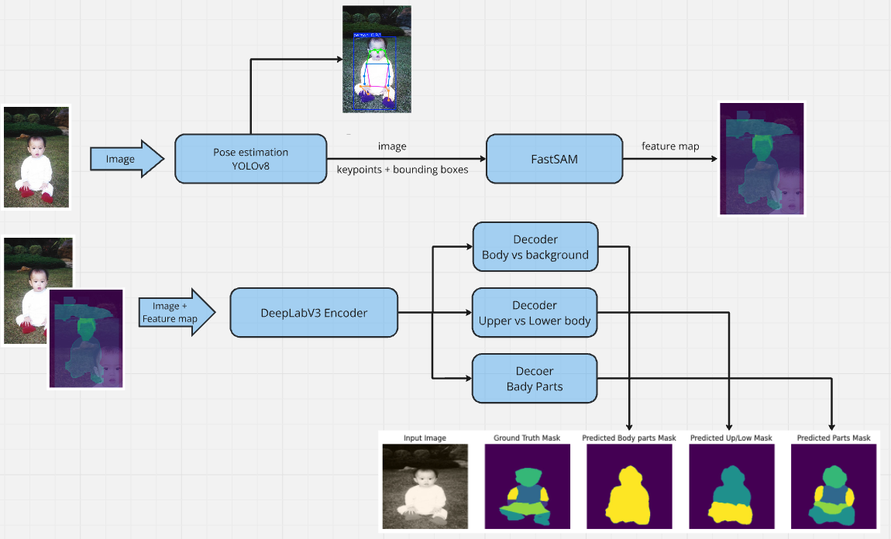
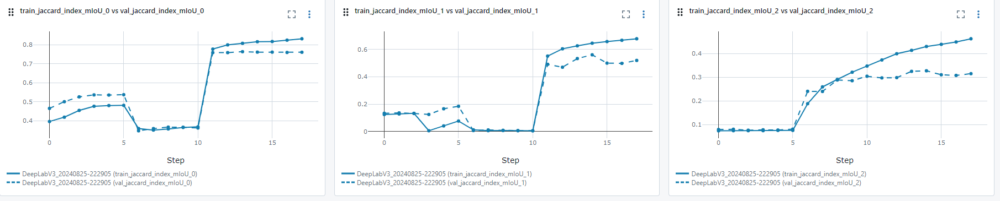
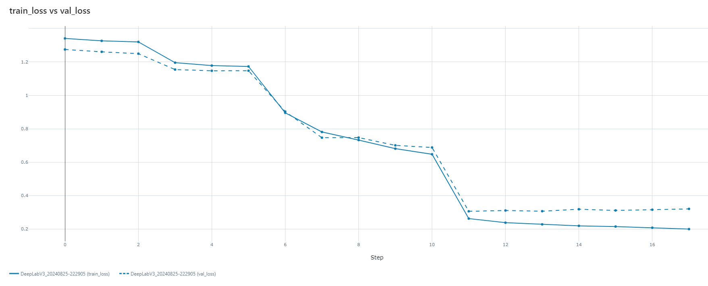

# Иерархическая семантическая сегментация с использованием датасета Pascal-Part

Проект реализует модель иерархической семантической сегментации, обученную на датасете Pascal-Part. Цель проекта — сегментировать изображения на различные части человеческого тела с учетом их иерархической структуры, например, верхняя часть тела, нижняя часть тела и конкретные части тела (руки, ноги и т.д.).

## Ключевые особенности

- **Иерархическая сегментация**: Модель сегментирует изображения на различных уровнях, от общего выделения тела на фоне до выделения конкретных частей тела.
- **Пользовательский модуль PyTorch Lightning**: Модульная и расширяемая реализация с использованием PyTorch Lightning.
- **Sota модели для выделения признаков**: Yolov8 для обнаружения положения тела и SAM для первичной сегментации 
- **Fine tuning**: Используются предобученные энкодеры из Segmentation Models PyTorch для более детальной и четкой сегментации.
- **Отслеживание экспериментов**: Интеграция с MLflow для удобного отслеживания экспериментов и управления моделями.

## Установка

Для запуска проекта необходимо установить все требуемые зависимости. Вы можете установить их с помощью `pip`:

```bash
git clone https://github.com/kopegor/hierarchical_segmentation.git
cd hierarchical_segmentation
```

```bash
conda create -n env_qc python=3.10
conda activate env_qc
pip install -r requirements.txt
```

## Запуск сервера mlflow для отслеживания экспериментов
Для отследивания результатов экспериментов необходимо запустить mlflow сервер. Будем использовать `tmux` для поддержки сервера в отдельной сессии.

```bash
tmux new -s mlflow_server

mlflow server --backend-store-uri sqlite:///mlflow.db --default-artifact-root ./lightning_logs --host 0.0.0.0 --port PORT
```

## Обучение модели
Для запуска обучения модели выполните следующую команду:
```bash
python train.py
```
Это запустит процесс обучения, и вы сможете отслеживать прогресс с помощью логов, предоставляемых PyTorch Lightning.

## Архитектура модели
### 1. Извлечение информации о положении тел
 
 На первом этапе работы модели происходит извлечение признаков положения тел с помощью `YOLOv8 (pose estimation)` и последующая предварительная сегментация изображения на основе полученных keypoints и bounding boxes с помощью `FastSAM` модели. Далее полученная карта признаков конкатенируется с исходным изображением и обрабатывается одномерной сверткой, чтобы "подсветить" важные области на изображении (по аналогии со scip connection) 

### 2. Энкодер
 
 Энкодер модели основан на предобученной архитектуре из библиотеки `Segmentation Models PyTorch (SMP)`. Мы используем архитектуру `DeepLabV3`, которая позволяет эффективно извлекать признаки на разных уровнях детализации. Предобученные веса энкодера, такие как ResNet, инициализируются на данных ImageNet для более точного и быстрого обучения на нашем наборе данных. На выходе с энкодера извлекается единая карта признаков для всех декодеров.

### 3. Декодеры для иерархической сегментации

Модель включает три отдельных декодера, каждый из которых отвечает за определенный уровень иерархии сегментации:

- *Декодер для сегментации тела (body vs. background)*: Определяет основные контуры тела на изображении.

- *Декодер для сегментации верхней и нижней частей тела (upper vs. lower body)*: Определяет границы между верхней и нижней частями тела.

- *Декодер для сегментации конкретных частей тела*: Этот декодер более детализированно сегментирует такие части тела, как руки, ноги, голова и т.д.


### 4. Постепенное размораживание весов
- На всех этапах обучения модели YLOv8-pose, SAM и энкодер остаются замороженными, поскольку это тяжелые модели и нужны только для извлечения признаков.

- На первых этапах обучается только декодер для верхнеуровневой сегментации всего тела, затем последовательно обучаются остальные декодеры. Это делается для адаптации весов декодеров к нашей задаче. 
- Далее, когда все декодеры немного подстроились под задачу, происходит совместное обучение всех декодеров.

### 5. Функции потерь и метрики
Для обучения модели используется функция потерь CrossEntropyLoss, а также Jaccard Index (или IoU), который позволяет оценивать качество сегментации на каждом уровне иерархии. Эти метрики логируются и отслеживаются с помощью MLflow, что позволяет анализировать эффективность модели в ходе обучения.

- На этапах обучения отдельных декодеров оптимизируется только соответствующая этому декодеру функция потерь (cross entropy)

- На этапе совместного обучения оптимизируется составная функция потерь - взвешенная сумма лоссов каждого декодера 

### Схема модели 
На изображении ниже представлена схема архитектуры модели, которая демонстрирует, как данные проходят через разные этапы сегментации и обработки:



## Результаты
В время обучения модели производился подсчет метрик mIoU на **валидационной выборке** для каждого уровня иерархии классов без учета фонового класса

- Наилучшие показатели метрики mIoU зафиксированы для вернеуровневой категории `body`: 

    mIoU<sup>0</sup> $\approx 0.76$

- Для категорий `upper_body`, `lower_body` второго уровня вложенности наилучшее значение метрики: 
    
    mIoU<sup>1</sup> $\approx 0.56$

- Для низкоуровненых категорий `low_hand`, `up_hand`, `torso`, `head`, `low_leg`, `up_leg` метрика, ожидаемо, имела более низкие значения:

    mIoU<sup>1</sup> $\approx 0.32$ 




<!--  -->
<!--  -->


## Предложения

### Данные 
 - Детальная работа с датасетом, поскольку есть достаточно много изображений, на которых люди изображены очень мелко, что затрудняет обучение модели

 - В процессе экпериментов была попытка увеличить датасет в два раза за счет добавления аугментаций, но это в разы повышает вычислительную нагрузку

 ### Модель
 - Для улучшения иерархической предсказательной способности модели стоит последовательно передавать выходы декодеров на следующий декодер (т.е. например выход с `decoder_body` добавить ко входу `decoder_up_low`). Такой способ был опробован в процессе экспериментов, но, опять же, это в разы замедляло обучение модели из за чего от него пришлось отказаться

- Fine tuning модели с более тонким подбором параметров, настройкой очередности обучения декодеров и подбором, возможно, более подходящей функции потерь

### Статьи
Для более глубокого погружения в тему стоит изучить методы указанные в статьях по данной тематике, например здесь:

[Li et al.,  Deep Hierarchical Semantic Segmentation](https://arxiv.org/abs/2203.14335)

[Lin et al., Cross-Domain Complementary Learning Using Pose for Multi-Person Part Segmentation](https://arxiv.org/abs/1907.05193)


